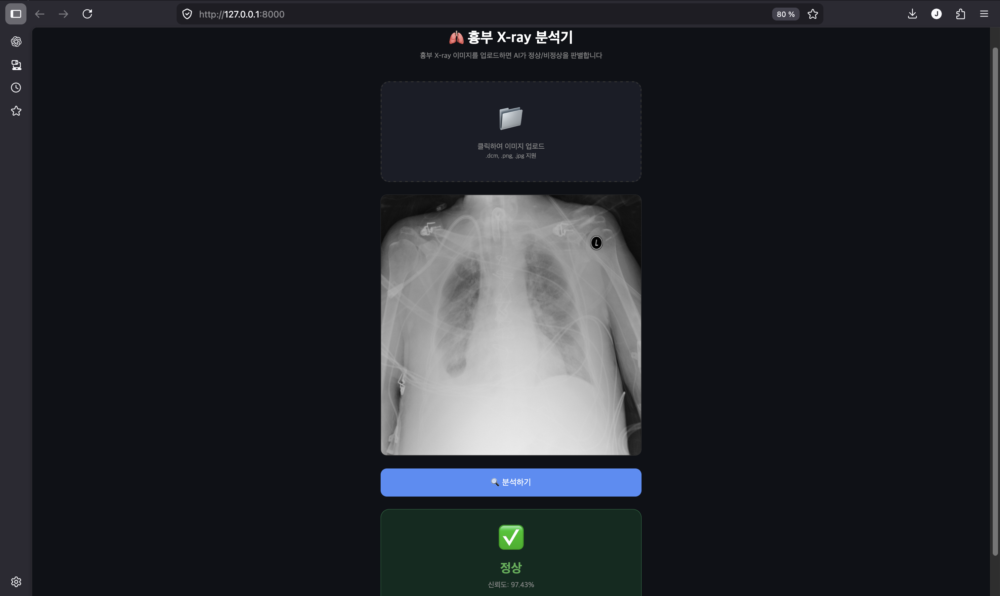

# 🫁 흉부 X-ray 정상/비정상 분류 AI 시스템

## 📸 시연



흉부 X-ray 이미지를 업로드하면 AI가 정상/비정상(폐렴 의심)을 판별하는 의료 AI 백엔드 프로젝트입니다.

## 🏗️ 시스템 아키텍처
클라이언트 → Spring Boot (JWT 인증, 8080)
→ FastAPI AI 서버 (8000)
→ MySQL DB

## 🛠️ 기술 스택

| 영역 | 기술 |
|---|---|
| AI 서버 | Python, FastAPI, PyTorch |
| AI 모델 | ResNet50 (Transfer Learning) |
| 백엔드 | Spring Boot 3, Spring Security, JPA |
| 데이터베이스 | MySQL |
| 인증 | JWT |
| 데이터셋 | RSNA Pneumonia Detection Challenge |

## ✨ 주요 기능

- 흉부 X-ray 이미지 업로드 (DCM, JPG, PNG 지원)
- AI 기반 정상/비정상 분류 (정확도 94.77%)
- 신뢰도 점수 제공
- 회원가입 / 로그인 (JWT 인증)
- 분석 히스토리 저장 및 조회

## 📊 모델 성능

- **아키텍처:** ResNet50 (ImageNet 사전학습 → 파인튜닝)
- **데이터셋:** RSNA Pneumonia Detection (26,684장)
- **학습 정확도:** 94.77%
- **학습 환경:** Apple M1 Pro (MPS 가속)

## 🚀 실행 방법

### AI 서버 (FastAPI)
```bash
conda activate xray
uvicorn predict:app --reload
```

### 백엔드 (Spring Boot)
```bash
# MySQL 실행
brew services start mysql

# Spring Boot 실행
./gradlew bootRun
```

## 📡 API 명세

### 인증
| Method | URL | 설명 |
|---|---|---|
| POST | /api/auth/register | 회원가입 |
| POST | /api/auth/login | 로그인 |

### 분석
| Method | URL | 설명 |
|---|---|---|
| POST | /api/analysis/predict | X-ray 분석 |
| GET | /api/analysis/history | 분석 히스토리 |

## ⚠️ 주의사항

본 서비스는 참고용이며 정확한 진단은 반드시 의사와 상담하시기 바랍니다.